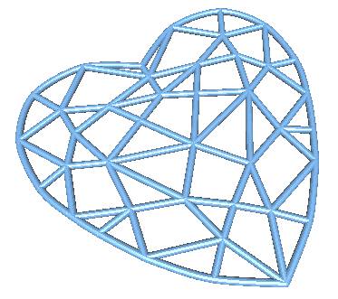

3d-heart-pendant
================

We want to create a 3D-printed pendant with the following shape:

In order to do this, the first step is to create a 3D file describing that shape. Like [all our 3D projects](http://ourlifein3d.blogspot.ca/2011/12/houdini-and-3ds-max.html), we are modelling using [Houdini](http://www.sidefx.com/).

Here is our result:

Here is a [3D view](heart-pendant.stl), and here is the [Shapeways item](https://www.shapeways.com/model/2623223/?li=aeTabs). It's not for sale because we are using a non-commercial Houdini license, but you can download the model and re-upload it in order to print your own.
